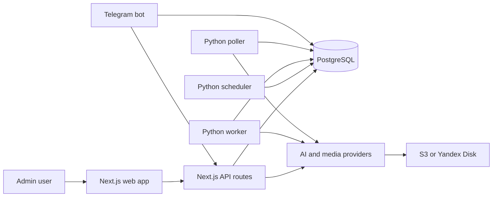

# OMNI REELS ANTON

Админ-консоль и автоматизация для производства AI short-form роликов. Проект хранит брифы продуктов, референсы, сценарии, аватары, задачи провайдеров, состояние очередей и готовые видео в одном PostgreSQL-backed workspace.

Текущий runtime: Next.js full-stack app плюс Python workers. Отдельного FastAPI-сервиса в активном стеке нет.

## Текущий стек

| Слой | Технологии | Основные файлы |
| --- | --- | --- |
| Web app и API | Next.js 16, React 19, TypeScript, App Router route handlers | `ui/src/app`, `ui/src/app/api` |
| UI state и компоненты | TanStack React Query, Tailwind CSS 4, shadcn/Radix UI, lucide-react | `ui/src/hooks`, `ui/src/components` |
| Server data access | `pg` из Next.js, прямой SQL | `ui/src/lib/db.ts`, `ui/src/lib/server` |
| Automation workers | Python 3, `requests`, `psycopg2`, provider SDKs | `services/v1` |
| Database | PostgreSQL 16 | `docker-compose.production.yml`, `services/v1/database/db_service.py` |
| Media runtime | FFmpeg внутри Docker image | `Dockerfile`, `ui/src/lib/server/omni/omni-video-stitcher.ts` |
| Deploy shape | Docker Compose: `web`, `postgres`, workers, poller, scheduler, Telegram bot | `docker-compose.production.yml` |

## Что делает проект

- Управляет клиентами, проектами, продуктами, референсами, аватарами, сценариями и сгенерированными роликами.
- Собирает Omni/KIE reel plan из контекста продукта, legacy-сценариев, reference assets, CTA-правил и avatar contracts.
- Отправляет задачи генерации видео в CometAPI Omni или KIE Gemini Omni, в зависимости от выбранного провайдера.
- Поддерживает legacy final-video pipeline: сценарий, TTS, STT timing, polling провайдеров, montage и storage.
- Загружает готовые видео в S3-compatible storage или Yandex Disk, в зависимости от env-настроек.
- Дает Telegram bot для ingestion и операционного управления.

## Архитектура



Next.js process отвечает за web UI, API routes, auth, большую часть Omni Studio, прямой PostgreSQL access и server-side provider adapters. Python workers отвечают за долгие automation tasks, которые нельзя держать внутри web request.

## Основные директории

| Путь | Ответственность |
| --- | --- |
| `ui/src/app` | Next.js pages, layout, global styles и API route handlers |
| `ui/src/components` | Dashboard, Omni Studio, settings, library, avatar и shared UI components |
| `ui/src/hooks` | React Query hooks и reusable client-side state |
| `ui/src/lib/omni` | Shared Omni types, provider names, prompt contracts и workspace helpers |
| `ui/src/lib/server/omni` | Server-side Omni domain logic, SQL access, prompt building, provider clients, stitching и storage |
| `ui/src/lib/server` | Auth, rate limiting, notifications, S3, Yandex Disk, subtitles, temp cleanup и provider helpers |
| `services/v1/automation` | Python pipeline stages, final-video queue worker, scheduler, poller, prompt и TTS services |
| `services/v1/providers` | Python provider clients для CometAPI, KIE, HeyGen, MiniMax, ElevenLabs и OpenAI image generation |
| `services/v1/ingestion` | Telegram bot и Instagram/RapidAPI ingestion |
| `services/v1/reels_factory` | Side-effect-free skeleton для будущего provider-neutral reel planning |
| `scripts` | Migration, cleanup и targeted smoke-test scripts |

## Generation flows

### Omni Studio flow

1. Пользователь выбирает Omni project и product в Next.js UI.
2. App связывает legacy scenarios, library references, product images, avatar references, CTA settings и creative strategy.
3. `ui/src/lib/server/omni/reels.ts` создает `omni_reels` и планирует `omni_reel_segments`.
4. `ui/src/lib/server/omni/omni-prompt-builder.ts` рендерит по одному prompt на segment: spoken text, product context, character contract, clothing contract, CTA rules и selected visual format.
5. `ui/src/lib/server/omni/omni-reel-runner.ts` отправляет segments выбранному провайдеру:
   - CometAPI использует `omni-fast`.
   - KIE использует `gemini-omni-video` и требует сохраненный `character_id`.
6. Готовые segment videos скачиваются, склеиваются через FFmpeg и загружаются в configured storage.

### Legacy final-video flow

Старый automation flow работает через таблицу `final_video_jobs` и Python workers:

1. `final_video_scheduler.py` создает queue jobs для eligible clients.
2. `final_video_worker.py` забирает active work и обрабатывает stages `scenario`, `omni_generate`, `waiting_omni`, `montage`.
3. `final_video_poller.py` обрабатывает waiting states `waiting_kie` и `waiting_heygen`.
4. `final_video_automation.py` координирует retries, backoff, requeue logic, provider status checks и финальные status updates.

Этот flow все еще важен для scheduled generation, legacy scenarios, HeyGen avatar work и montage/storage automation.

## Провайдеры и env

Source of truth для переменных окружения: `.env.example`.

| Provider | Роль | Переменные |
| --- | --- | --- |
| OpenRouter | Script, visual и prompt generation | `OPENROUTER_API_KEY`, `SCENARIO_MODEL` |
| CometAPI | Omni video generation и avatar image generation | `COMETAPI_KEY`, `COMETAPI_BASE_URL` |
| KIE.ai | Gemini Omni video, character creation, legacy B-roll | `KIE_API_KEY` или `KIE_AI_API_KEY` |
| HeyGen | Avatar video generation | `HEYGEN_API_KEY` |
| MiniMax | Russian TTS | `MINIMAX_API_KEY`, `MINIMAX_GROUP_ID`, `MINIMAX_BASE_URL` |
| ElevenLabs | Alternate TTS и cloned voices | `ELEVENLABS_API_KEY` |
| Deepgram | Word timings и transcription support | `DEEPGRAM_API_KEY` |
| RapidAPI | Instagram/Reels ingestion | `RAPIDAPI_KEY`, `RAPIDAPI_INSTAGRAM_HOST`, `RAPIDAPI_INSTAGRAM_ENDPOINT` |
| Telegram | Bot, auth и notifications | `TELEGRAM_BOT_TOKEN`, admin IDs, `WEBAPP_BASE_URL` |
| Yandex Disk | Legacy/final video storage | `YANDEX_DISK_OAUTH_TOKEN` или fallback token vars |
| S3-compatible storage | Uploaded references и generated Omni videos | `S3_ENDPOINT`, `S3_BUCKET`, `S3_ACCESS_KEY_ID`, `S3_SECRET_ACCESS_KEY`, `S3_PUBLIC_BASE_URL` |

Database settings: `DB_HOST`, `DB_PORT`, `DB_NAME`, `DB_USER`, `DB_PASS`. Legacy bridge reads могут использовать `OLD_DB_*` или `LEGACY_DB_*`, если текущий workspace должен читать старые scenario или library data.

## Local development

Установить Node dependencies нужно в UI workspace:

```bash
cd ui
npm install
```

Создайте локальный `.env` из `.env.example`, затем настройте `DB_HOST`, `DB_PORT`, `DB_NAME`, `DB_USER` и `DB_PASS` на доступный PostgreSQL instance.

Запуск dev server:

```bash
cd ui
npm run dev
```

По умолчанию app доступен на `http://localhost:3000`. API routes отдаются тем же Next.js process.

## Docker runtime

Production Docker image использует `node:20-bookworm-slim`, ставит Python dependencies в virtual environment, ставит FFmpeg, собирает `ui`, инициализирует базу и запускает Next.js:

```bash
docker compose -f docker-compose.production.yml up --build
```

`docker-compose.production.yml` определяет services:

- `postgres`
- `web`
- `final-video-worker`
- `final-video-poller`
- `final-video-scheduler`
- `telegram-bot`

Compose exposes `web:3000` внутри Docker networks. Для публичного доступа нужен reverse proxy или отдельный `ports` mapping.

`docker-compose.override.yml` deployment-specific: он подключает app к внешним Easypanel и legacy networks и может убирать legacy workers за Compose profile.

## Useful commands

Запускайте команды из repository root, если команда явно не переходит в `ui`.

```bash
cd ui
npm run build
npm run lint
```

Targeted Python smoke tests лежат в `scripts`:

```bash
python3 -m unittest scripts.test_omni_smart_layer
python3 -m unittest scripts.test_omni_life_formats
python3 -m unittest scripts.test_omni_comet_client
python3 -m unittest scripts.test_omni_pipeline_e2e
```

Targeted TypeScript smoke tests запускаются через Node scripts, которые сами компилируют нужные TypeScript modules через project compiler:

```bash
node scripts/test_omni_cta_contract.mjs
node scripts/test_omni_segment_planner.mjs
node scripts/test_omni_visual_style_writer.mjs
```

## API и auth

Большинство protected API routes вызывает `validateApiRequest` из `ui/src/lib/server/telegram-auth.ts`.

- User sessions используют cookie `tg_session`.
- Staging access может использовать cookie `staging_auth`.
- Rate limit по умолчанию: 100 requests per minute на user или IP.
- `/api/health` проверяет database connectivity.

Основные route groups:

- `/api/omni/*` - Omni projects, products, avatars, scripts, references, reels и legacy links.
- `/api/scenarios/*` - legacy scenario generation, feedback, timestamps, montage и assembly.
- `/api/kie/*` - legacy KIE submit и poll helpers.
- `/api/automation/final-videos/manual-run` - manual final-video queue creation.
- `/api/yandex-disk/*` - storage folder helpers.

## Notes for maintainers

- Новую Omni logic по возможности держите в `ui/src/lib/server/omni` и `ui/src/lib/omni`.
- Python provider work держите в `services/v1/providers`, а queue orchestration - в `services/v1/automation`.
- Не добавляйте существенную новую логику в oversized route handlers или screen components. Сначала выделяйте focused modules.
- Для runtime facts доверяйте `.env.example`, `docker-compose.production.yml` и реальным provider clients, а не старым README claims.
- Перед изменением provider endpoints или payload shape сверяйтесь с документацией провайдера.
